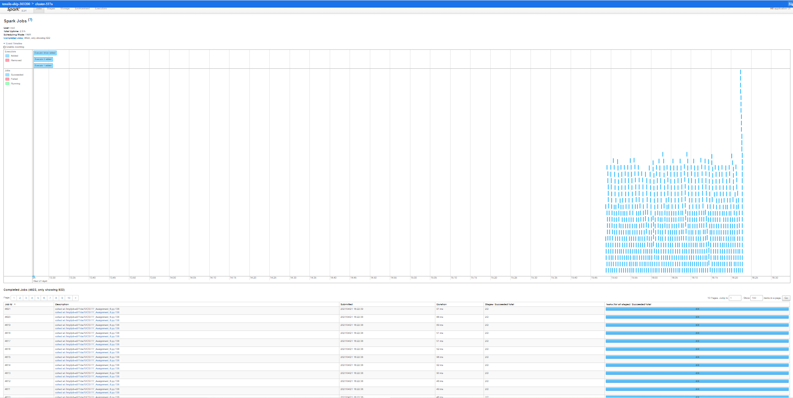

# Introduction




This project aims to apply the MCMC algorithm to achieve the clustering of text documents.

The ``docs``directory contains spark history logs and the result of the tasks.


# Getting Started  

Run the task by submitting the task to spark-submit. 


```python

spark-submit main_task1.py 

```


